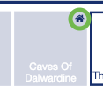
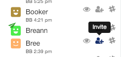
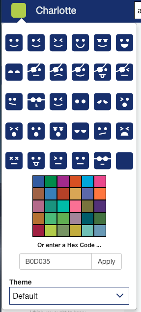
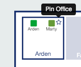
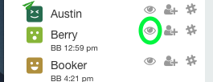

# Your First Day

You’re about start an awesome new office lifestyle. But fair warning - you may never want to return to a traditional office!
### Let’s get the boring stuff out of the way
Before you're ready to enter your new qube you need both a Zoom and a Slack account. Contact your System Administrator if you do not have an account for both.

*Note: Slack integration works best when you have the desktop client installed. Please install from <https://slack.com/downloads> on your primary computer(s) if you're still using the browser version. It takes only 30 seconds.*
*To ensure you're not displayed as a Guest User while in Zoom Meetings make sure that you are logged into  Zoom and that your Zoom application is always up and running.*

**qube is only tested and supported in Google Chrome.**

To login to your new virtual office click the link provided by your system administrator and use your slack credentials to login. **Be sure to accept all permissions.** If prompted to enter a slack team, make sure you enter the team name as provided by your admin.
*Please note that qube should not be used in Incognito Mode, without cookies or aggressive ad blockers.*

### Settle in.
Let’s get started by **claiming your home office**. Find your new office (your office admin may have set aside a qube for you), and click on the home icon that appears in the lower right hand corner when you hover over it.

You’ll automatically be returned here at the end of meetings.

Next, update your name and office name if you need to (click to edit). We recommend you choose a creative room name - your co-workers will appreciate it!

### Meet your new co-workers.
Double click to enter a common room (conference rooms, auditorium, water cooler, etc) or knock on someone’s office. You can also invite someone to your current room by clicking on the invite button next to their name in the side panel.

On the flip side, if you receive a knock or invite, simply click on the notification to allow someone entrance into your office.
Once you enter someone's office a Zoom meeting will automatically start.

**Good things may take a while so please be patient while your Zoom meeting starts.**

The first time you meet with someone, make sure to click always open in Zoom (there will be a checkbox when it firsts asks you). When Zoom opens for you, click “always use computer audio”. This will ensure that meetings open quickly after the first time.
Zoom meetings (usually) start automatically when entering someone's office. In conference rooms however, meetings have to manually be started using the start meeting button.
If you enter a room with an ongoing meeting and the meeting does not automatically start for you click the "join meeting" button.
To share a link to the meeting with others you can click on the copy icon right next to the "join meeting" button. This will copy the meeting URL to your clipboard.

Once the host ends the Zoom meeting all participants are automatically sent home.

### Make it yours.
It's your qube after all. Not too fond of our default color scheme? Well, maybe you prefer Dark Knight or Darcula to match your IDE’s dark theme? Or try out our weather theme for a little seasonal change and a few surprises ;)
To customize your theme click on your Avatar in the top left corner and select a different theme option.

You can also let others know how you feel by selecting an emotion as well as changing your avatar color.

### Be present.
Except when you're not. Stepping out to walk the dog? Grabbing lunch? Let your co-workers know! Update your status and enter a "back by time". Don't worry about doing time zone math - qube will show each user all times in their local timezone.

### Pick your favorites.
*(Note: this only applies to multi-level qube installation)*

Pin the offices of the people you talk to (like?) most on other floors (click the star icon in the upper right corner of any office). You’ll be able to see and knock on their offices without having to change floors - you will however, have to sacrifice one of your office plants.

### Be watchful.
You know how some people always seem to be in meetings? Some of us have acquired the skill of pouncing exactly in between meetings. For everyone else, we’ve added the ability to “watch” people and be notified when they’re back from breakfast or finished with meetings.
To start watching a co-worker click on the eye next to the person you'd like to watch. To unwatch a person just click the same icon again.

Watching works in reverse, too - if you’ve just ended a meeting, we’ll (wait a few minutes so you can catch your breath and then) send you a list of people who’re interested in talking to you.

*Advanced feature - you can check the list of people you’re watching or who are watching you by running `/qube watching` or `/qube watchers` in slack. (Type `/qube help` if you need reminders of available slack commands).*

### Find co-workers quickly.
Just hover over a co-workers name in the side panel and you'll see them jump up and down happily. A double click will knock on the room the user's currently in (an advanced feature for the impatient ones).

### Enjoy the short commute.
Just open qube to start working, and close it to stop! You don't need to logout, unless you're on a public machine or really want to.
