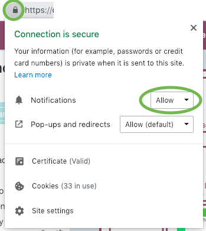

## Troubleshooting/FAQs

**I don't receive a notification when someone is knocking on my door.**
First, make sure you have allowed qube to receive notifications. To do so click on the lock icon next to the URL in your browser.
Ensure that the dropdown for Notifications says "Allow". If not, change it accordingly.

Still no luck? Use the power button in the top right toolbar to logout and then log back in.
Also, be sure to disable Focus Assist/Do Not Disturb Mode as those will block qube notifications.

**My Zoom meeting is taking a long time to start.**
Here's a few tips to speed up your meeting launches:
- If you're hosting the meeting (the meeting is taking place in your office), click the 'start meeting' button. This will force Zoom to start.
- If you're joining a meeting (you're in someone else's office), click 'join meeting' as soon as the spinner next to the 'join meeting' button disappears. This will force Zoom to start. (The spinner means we're waiting on your host to start the meeting).
- If you accept a knock or invite, bring qube into focus. This will speed up your Zoom launch. If you have multiple monitors (or connect your laptop to a monitor), keeping qube in focus in one desktop (while continuing your work on your primary monitor(s)) will ensure that meetings start quickly.

**How do I run qube as a standalone app? How do I add qube appear in my task bar/dock?**

If you're on Windows, you are out of luck :( As of Nov 2018, Chrome removed the possibility to run qube as its own app.

If you’re on a Mac, download Epichrome from <https://github.com/dmarmor/epichrome/releases> (choose the dmg file). Then:

1. Open Epichrome.
 If you see an error message (“Epichrome” can’t be opened because it is from an unidentified developer.), then go to System Preferences -> Security & Privacy, and click on ‘Open Anyway’ for Epichrome.
3. Use the appname “qube”.
4. Click “App Window”
5. Use the url of your qube installation (for example https://qube.mycompany.com)
6. Don’t register the app as a browser (Choose no)
7. Provide a custom icon, using the file below.
8. Click create.
9. Click launch now.
10. Make sure to allow notifications.

**I received a notification that my browser has rejected qube notifications, and I've been logged out automatically. Should I be concerned?**
No, everything's fine. Browser rejections can happen for a variety of reason, including browser upgrades, network switching, and expiration (over a week of not using qube).

**The office isn't working! People can knock or invite and the notifications show up, but no meeting is started (and individuals don't move to the new room). What's happening, and how do we fix this?**
This is probably a server issue (mysql connection pool failure). Your server admin should be able to fix this with a redeploy.

**Can I invite offline co-workers to a meeting in qube?** Of course! This is helpful for co-workers who are on the road or find themselves without Internet access. Click the call button that appears next to someone in the side panel. This will send them a slack message with options to connect from a the Zoom app or with a regular phone number.

**Can I invite a random person to a meeting in qube?** Kind of. Click on the clipboard icon attached to the join button. You should be able to send it out to anyone, and they will be able to join you in the Zoom meeting.

**Can I invite co-workers to my office without starting a Zoom meeting?** Sure! You may want to do this if you're working together in the same room or using an alternative means of communication (such as Screenhero or a phone call). This way, your co-workers will know that you're chatting with someone. Click on the 'end meeting' dropdown and click 'cancel meeting'.

**Can I set myself to 'Away' indefinitely?**
The idea behind 'Away' is to let others know when to bug you away. If you're not sure when you'll be back (but it's probably soon), you should use the 'busy' status. If it might be tomorrow or sometime in the far future, close out of qube so you don't appear to be online.

**Ahh! I think I lost my last notification.** The last 10 knock/invite events are listed in your history (available under settings (the gear icon)).

**Ahh! Something has gone wrong, and I've lost my Zoom meeting.** It's okay - just sign back into qube and click 'join meeting' to rejoin.

**Can I use qube on my phone?** No. But you can update your qube status through Slack from your phone.

**Can I login to qube from multiple browsers/tab?** No, and I'm not even sure why you'd want to. You can't exist in multiple offices at the same time in the real world, either.
