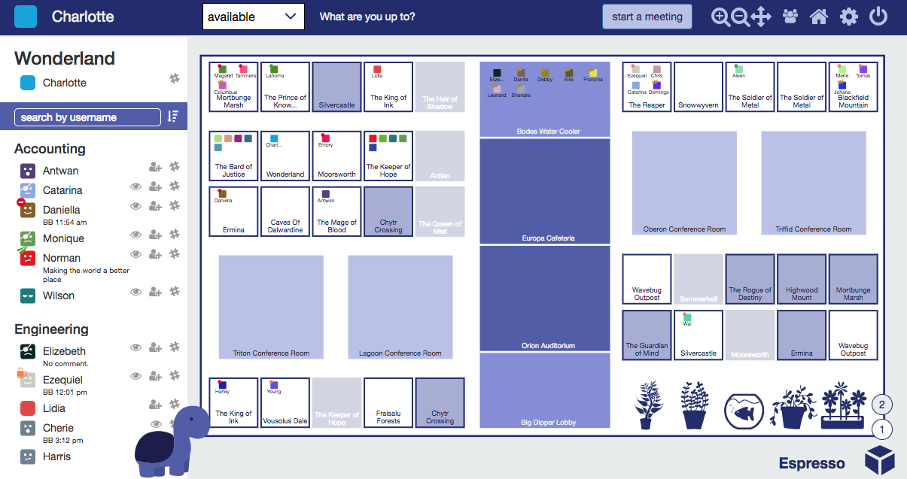
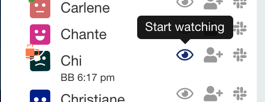

You’re about start an awesome new office lifestyle. But fair warning - you may never want to return to a traditional office!

### Private Meetings

*Start meetings seamlessly.* Double click to knock on someone's office. This will send a desktop notification to everyone in that office. When someone accepts, you'll automatically be pulled into their office and setup with an instant Zoom meeting.

*Invite someone to an ongoing meeting.* Click the invite button next to someone's name in the side panel.

*Return home instantly after meetings end.* A meeting host (typically the owner of an office) can use Zoom's 'end meeting' button to end a meeting and send everyone home automatically. If your meeting host mysteriously disappears, anyone in the meeting can fill in by using qube's 'end meeting' button.

*Notifications expire after two minutes.* If you accept a knock from a co-worker after two minutes, your co-worker may have moved on already. That's okay - we'll invite your co-worker back to your office. Same thing for invites.

*Use conference rooms and common spaces for events and larger meetings.* Double click to enter a conference room or common space. Anyone (but probably the meeting owner, if there is one) can click 'start meeting' to open an instant Zoom meeting. There are no restrictions on who can enter a meeting room.

### Customizable Offices

*Update your name, office name, or status* by clicking and editing. States can be changed using the dropdown (available, busy, away, BRB, feeling social). Since context is so important in a virtual environment, we strongly recommend you set a status and 'back by' time when you set yourself to away, BRB, or busy.

*Choose your avatar color and emoji.* Office life doesn't have to be so serious :) And while we're at it, make sure you choose a creative room name - your co-workers will appreciate it!

*Customize your office theme.* Maybe you prefer Dark Knight or Darcula to match your IDE's dark theme? Or try out our weather theme for a little seasonal change and a few surprises ;)

*Notifications with a little bit of snark.* Well, if you're that guy that never opens Slack or is constantly late coming back from lunch I think we can have a little bit of fun :D

### People Watching

Not sure where someone is? Hover over a user's name in the sidebar for one second, and qube will **spotlight** your person of interest. They'll even do a little dance!

But seriously. You know how some people always seem to be in meetings? Some of us have acquired the skill of pouncing exactly in between meetings. For everyone else, we've added the ability to "watch" people and be notified when they're back from breakfast or finished with meetings.

Watching works in reverse, too - if you've just ended a meeting, we'll (wait a few minutes so you can catch your breath and then) send you a list of people who're interested in talking to you.

Advanced feature - you can check the list of people you're watching or who are watching you by running `/qube watching` or `/qube watchers` in slack. (Type `/qube help` if you need reminders of available slack commands).

### Intelligent Time Zones

*View all statuses in your local timezone.* Working remotely is awesome! Constantly converting time zones isn't. When you set your state to busy , away or BRB, you'll notice we ask you for a 'back by' time. Enter when you'll be back in a supported format (such as 1400 or 3pm) in your local timezone. This lets us display all 'back by' times in local times in the sidebar.

*Keep office statuses up to date.* Are you in the habit of taking reeaaalllly long lunches because you keep forgetting to update your status when you get back? Well, no more! Slack reminders are here to check up on you when you forget.

*Travel without worrying about timezones.* For the wanderers and world travelers! qube will auto-detect and update your timezone for your traveling convenience.

### Advanced Slack Support

*Update your qube status through slack.* Forgot to update your qube status before stepping away? Update your status through slack using the new **/qube** command. Example: `/qube emergency ice cream break`

*Slack everyone in your office.* Need to slack everyone in your office with notes at the end of a productive meeting? Use the slack icons in the sidebar to open direct messages to the people you're talking to.

**Note: Slack integration works best when you have the desktop client installed. Please install from [https://slack.com/downloads](https://www.google.com/url?q=https://slack.com/downloads&sa=D&ust=1544216473551000) on your primary computer(s) if you're still using the browser version. It takes only 30 seconds.**

### Advanced Zoom support

*Import sheduled Zoom meetings.* For executives or sales staff especially! When you start a scheduled a Zoom meeting with a (potential) customer, qube will automatically update your state to 'busy' and your status with relevant details.

*Host scheduled Zoom meetings.* Offices can now host scheduled meetings. That means if you get stuck in a external customer call and need co-worker support, you can simply invite them to your office (instead of copying/pasting the Zoom link or forwarding a meeting invite).

*Start meetings in qube with your personal Zoom link.* Just enable 'Always use Zoom Personal Meeting ID to start meetings' under settings (the gear icon) in qube. (Note - meetings with PMIDs will take longer to start, so enable only if you use personal Zoom links, and consider starting conference room/auditorium meetings a minute or two early).
